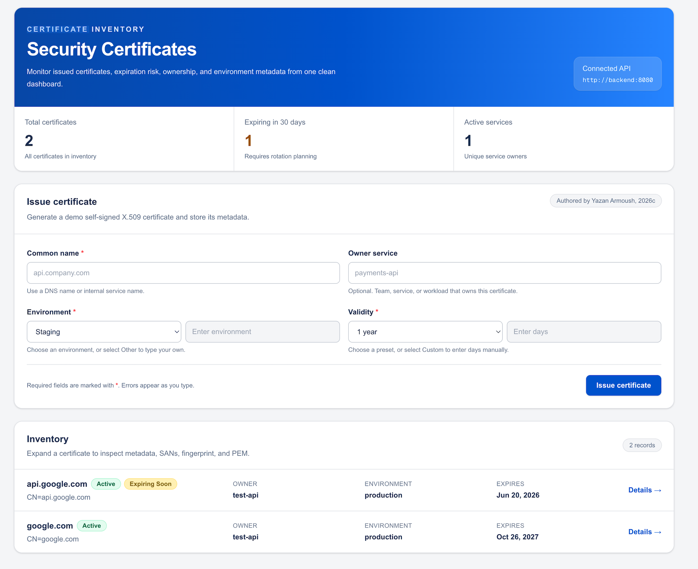

# Certificate Inventory Platform

### Certificate Inventory Dashboard



Secure certificate inventory MVP with:
- Rust backend API
- PostgreSQL storage
- Next.js frontend
- Docker Compose local environment
- TLS/mTLS and Kubernetes system design notes

# Certificate Inventory Platform

A full-stack certificate inventory and issuance platform built with Rust, PostgreSQL, Docker, and Next.js.

## Overview

This project was completed as part of the Arkion technical assessment and demonstrates:

- Certificate inventory management
- X.509 certificate issuance workflows
- Rust microservice development
- PostgreSQL data modeling
- Next.js Server-Side Rendering (SSR)
- Docker-based deployment
- Secure microservice architecture design
- TLS and mTLS concepts

## Features

### Backend

- Create certificate metadata
- Generate self-signed X.509 certificates
- Retrieve certificate details
- List certificates
- Dashboard statistics
- PostgreSQL persistence

### Frontend

- SSR inventory dashboard
- Certificate detail views
- Certificate issuance form
- Responsive desktop and mobile UI
- Error handling and retry logic

### Security

- TLS-ready architecture
- mTLS design for internal service communication
- Non-root container execution
- Audit-friendly certificate metadata storage

## API Endpoints

### Health

```http
GET /health
```

### Certificates

```http
GET  /certificates
GET  /certificates/{id}
POST /certificates
POST /certificates/issue
GET  /certificates/stats
```

## Project Structure

```text
arkion_cert-inventory-platform/
├── backend/
├── frontend/
├── docs/
├── README.md
└── docker-compose.yml
```

## Running Locally

```bash
docker compose up --build
```

Frontend:

```text
http://localhost:3000
```

Backend:

```text
http://localhost:8081
```

## Documentation

Additional design documentation is available in:

- docs/system-design.md
- docs/tls-mtls.md
- docs/kubernetes.md